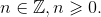

**Лабораторная работа №3 (Вариант II)**

# Метапрограммирование. Мемоизация и отложенные вычисления. Ввод-вывод

## Цель работы

На примере языка Scheme практике ознакомиться со средствами метапрограммирования ("код как данные", макросы) и подходами к оптимизации вычислений (мемоизация результатов вычислений, отложенные вычисления).

В работе также предлагается разработать дополнительное средство отладки программ — каркас для отладки с помощью утверждений. На этом примере предлагается ознакомится с типичным применением программирования с использованием продолжений.

## Вопросы для допуска к работе

1.  Приведите пример применения продолжения. Что выполняет встроенная процедура `call-with-current-continuation`?

2.  Из каких основных частей состоит определение гигиенического макроса на языке Scheme? Какое назначение этих частей? В каком порядке осуществляется сопоставление с образцами синтаксических правил? В каком случае в определение макроса необходимо включать ключевые слова? Поясните на примере.

3.  Приведите примеры образца синтаксического правила для применения макроса к: (а) одному аргументу, (б) одному аргументу — пустому списку, (в) двум аргументам, один из которых является списком, состоящим не менее чем из одного элемента, а второй — списком строго из двух элементов.

5.  Каким образом на языке Scheme можно реализовать процедуру со статической переменной?

5.  Что такое мемоизация? Для чего она применяется? Какими свойствами должна обладать функция (процедура) в программе, чтобы для нее имела смысл мемоизация? Почему?

6.  Что такое мемоизация? Каким образом можно реализовать мемоизацию результатов вычислений на языке Scheme?

7.  Для чего предназначены встроенные примитивы `delay` и `force`?

8.  Какие основные процедуры имеются в языке Scheme для осуществления ввода и вывода?

## Задания

0.  **Продолжения.** Утверждение (assertion) — проверка на истинность некоторого условия, заданного программистом. По традиции осуществляется процедурой (функцией) с именем `assert`. Включается в код во время написания кода и отладки с целью установки ограничений на значения и выявления недопустимых значений. Если в процессе выполнения программы указанное условие нарушается, то программа завершается с выводом диагностического сообщения о том, какое условие было нарушено. Если условие соблюдено, то выполнение программы продолжается, никаких сообщений не выводится.

    Реализуйте каркас (фреймворк) для отладки с помощью утверждений. Пусть ваша каркас перед использованием инициализируется вызовом `(use-assertions)`, а сами утверждения записываются в коде ниже в виде `(assert условие)`. Если условие не выполнено, происходит завершение работы программы без возникновения ошибки выполнения и вывод в консоль диагностического сообщения вида `FAILED: условие`. Пример использования каркаса:

    ```nohighlight
    (use-assertions) ; Инициализация вашего каркаса перед использованием
    
    ; Определение процедуры, требующей верификации переданного ей значения:
    
    (define (1/x x)
      (assert (not (zero? x))) ; Утверждение: x ДОЛЖЕН БЫТЬ > 0
      (/ 1 x))
    
    ; Применение процедуры с утверждением:
    
    (map 1/x '(1 2 3 4 5))) ; ВЕРНЕТ список значений в программу
    
    (map 1/x '(-2 -1 0 1 2))) 
    ;
    ; ВЫВЕДЕТ в консоль сообщение и завершит работу программы
    ```
    
    Сообщение, которое должно быть выведено при выполнении примера, показанного выше:

    ```nohighlight
    FAILED: (not (zero? x))
    ```
    
    Важно! Если в программе используются гигиенические макросы и эта программа будет выполнена в среде guile 1.8.x (в том числе на сервере тестирования), то следует подключить модуль поддержки таких макросов, написав в начале программы следующую строку:

    ```nohighlight
    (use-syntax (ice-9 syncase))
    ```

0.  **Код как данные. Порты ввода-вывода.** 

    -   *Сериализация данных.* Реализуйте процедуры для записи данных из переменной в файл по заданному пути (т.е. для сериализации) и последующего чтения данных (десериализации) из такого файла:
    
        ```nohighlight
        (save-data данные путь-к-файлу)
        (load-data путь-к-файлу) ⇒ данные
        ```
        
    -   *Подсчет строк в текстовом файле.* Реализуйте процедуру, принимающую в качестве аргумента путь к текстовому файлу и возвращающая число *непустых* строк в этом файле. Используйте процедуры, разработанные вами ранее в рамках выполнения домашних заданий.

0.  **Мемоизация результатов вычислений.** Реализуйте функцию вычисления n-го "числа трибоначчи" (последовательности чисел, которой первые три числа равны соответственно 0, 0 и 1, а каждое последующее число — сумме предыдущих трех чисел):

    
    
    
    
     Реализуйте версию этой функции с мемоизацией результатов вычислений. Сравните время вычисления значения функций для разных (умеренно больших) значений её аргументов без мемоизации и с мемоизацией. Для точного измерения вычисления рекомендуется использовать команду REPL Guile `,time` (Guile 2.x).

0.  **Отложенные вычисления.** Используя примитивы для отложенных вычислений `delay` и `force`, реализуйте макрос `my-if`, который полностью воспроизводит поведение встроенной условной конструкции (специальной формы) `if` для выражений, возвращающих значения. Например, такие примеры должны вычисляться корректно:

    ```nohighlight
    (my-if #t 1 (/ 1 0)) ⇒ 1
    (my-if #f (/ 1 0) 1) ⇒ 1
    ```

    *Запрещается* использовать встроенные условные конструкции `if`, `cond`, `case` и перехват исключений.


