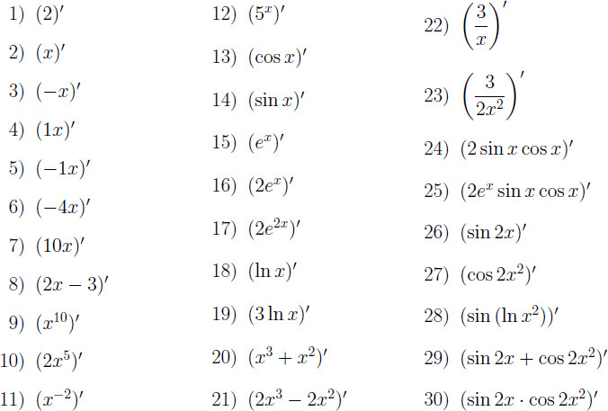

# Домашнее задание №3

Реализуйте процедуру `derivative`, находящую производную функции одной переменной по правилам дифференцирования. Пусть процедура принимает один аргумент — выражение на языке Scheme, которой задана функция, и возвращает также выражение на языке Scheme, соответствующее производной. Выражения должны быть пригодны для выполнения с помощью встроенной процедуры `eval`.

Реализуйте нахождение производных константы, линейной, степенной, показательной (включая экспоненту), натурального логарифма, тригонометрических функций (синуса и косинуса), а также суммы, произведения, частного и композиции функций. Не следует ограничивать число слагаемых в сумме, множителей в произведении и функций в композиции. Упрощение выражений не требуется.

Ваша процедура должна находить решения по крайней мере следующих примеров:



Примеры вызова процедуры:

```scheme
(derivative '(expt x 10)) ⇒ (* 10 (expt x 9))
(derivative '(* 2 (expt x 5))) ⇒ (* 2 (* 5 (expt x 4)))
(derivative (list '* 'x 'x)) ⇒ (+ (* x 1) (* 1 x))
```

Рекомендации:

1.  Выбирайте наиболее общие формулы дифференцирования, обработку частных случаев разрабатывайте только при необходимости.

2.  Так как упрощение выражений не предусматривается, вполне приемлемым будет результат вычисления, например, вида `(* 3 (/ 1 x))`, или `(* 2 (expt x 1))`, или `(* 0 (* 2 (expt x 2)))`.

3.  Разрабатывайте программу через тестирование. Для этого реализуйте каркас для юнит-тестирования. На основе приведенных выше примеров напишите набор тестов для вашей процедуры и ведите разработку так, чтобы добиться правильного выполнения всех тестов. Выполняйте тесты после каждого внесения изменений и дополнений в вашу программу.

4.  Предложите способ сделать тесты нечувствительными к способу представления результата, где это возможно. Например, `(* (exp x) (sin x))` на `(* (sin x) (exp x)))` и `(/ 3 x)` `(* 3 (/ 1 x))` должны проходить один и тот же тест.

## «Ачивки»

* Написать функцию `simplify`, упрощающую арифметические выражения: умножения
  на `0` или `1`, сложение с нулём — **+1 балл.**
* Написать макрос `flatten` (т.е. функцию `flatten` из [ДЗ 2](home2.md)
  в виде макроса) — **+1 балл.**
  ```scheme
  (flatten (((+) 1) (2 (3) ((4))))) ⇒ 10
  ```
  т.к.
  ```scheme
  (+ 1 2 3 4) ⇒ 10
  ```
* Написать макрос `mderivative` — **+1 балл.**
  ```scheme
  (define (der-cube x)
    (mderivative (expt x 3)))

  (der-cube 10) ⇒ 300
  ```
