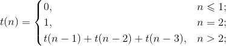

# Лабораторная работа №4

## Цели работы

На примере языка Scheme ознакомиться со средствами метапрограммирования
(«код как данные», макросы) и подходами к оптимизации вычислений (мемоизация
результатов вычислений, отложенные вычисления).

В работе также предлагается разработать дополнительное средство отладки программ —
каркас для отладки с помощью утверждений. На этом примере предлагается ознакомится
с типичным применением программирования с использованием продолжений.


## Задания

### 1. Продолжения.

Утверждение (assertion) — проверка на истинность некоторого условия, заданного
программистом. По традиции осуществляется процедурой (функцией)
с именем `assert`. Включается в код во время написания кода и отладки
с целью установки ограничений на значения и выявления недопустимых значений.
Если в процессе выполнения программы указанное условие нарушается, то программа
завершается с выводом диагностического сообщения о том, какое условие было
нарушено. Если условие соблюдено, то выполнение программы продолжается, никаких
сообщений не выводится.

Реализуйте каркас (фреймворк) для отладки с помощью утверждений. Пусть Ваш каркас
перед использованием инициализируется вызовом `(use-assertions)`, а сами
утверждения записываются в коде ниже в виде `(assert условие)`. Если условие
не выполнено, происходит завершение работы программы без возникновения ошибки
выполнения и вывод в консоль диагностического сообщения вида `FAILED: условие`.
Пример использования каркаса:

```Scheme
(use-assertions) ; Инициализация вашего каркаса перед использованием

; Определение процедуры, требующей верификации переданного ей значения:

(define (1/x x)
  (assert (not (zero? x))) ; Утверждение: x ДОЛЖЕН БЫТЬ ≠ 0
  (/ 1 x))

; Применение процедуры с утверждением:

(map 1/x '(1 2 3 4 5)) ; ВЕРНЕТ список значений в программу

(map 1/x '(-2 -1 0 1 2)) ; ВЫВЕДЕТ в консоль сообщение и завершит работу программы
```

Сообщение, которое должно быть выведено при выполнении примера, показанного выше:

```nohighlight
FAILED: (not (zero? x))
```

Важно! Если в программе используются гигиенические макросы и эта программа будет
выполнена в среде guile 1.8.x (в том числе на сервере тестирования), то следует
подключить модуль поддержки таких макросов, написав в начале программы следующую
строку:

```nohighlight
(use-syntax (ice-9 syncase))
```

### 2. Код как данные. Порты ввода-вывода.

- *Сериализация данных.* Реализуйте процедуры для записи данных из переменной
  в файл по заданному пути (т.е. для сериализации) и последующего чтения данных
  (десериализации) из такого файла:

  ```nohighlight
  (save-data данные путь-к-файлу)
  (load-data путь-к-файлу) ⇒ данные
  ```

- *Подсчет строк в текстовом файле.* Реализуйте процедуру, принимающую в качестве
  аргумента путь к текстовому файлу и возвращающую число *непустых* строк в этом
  файле. Используйте процедуры, разработанные вами ранее в рамках выполнения
  домашних заданий.

### 3. Мемоизация результатов вычислений.

Реализуйте функцию вычисления n-го "числа
трибоначчи" (последовательности чисел, которой первые три числа равны соответственно
0, 0 и 1, а каждое последующее число — сумме предыдущих трех чисел):




Реализуйте версию этой функции с мемоизацией результатов вычислений. Сравните время
вычисления значения функций для разных (умеренно больших) значений её аргументов без
мемоизации и с мемоизацией. Для точного измерения вычисления рекомендуется
использовать команду REPL Guile `time` (Guile 2.x).

### 4. Отложенные вычисления.

Используя примитивы для отложенных вычислений `delay`
и `force`, реализуйте макрос `my-if`, который полностью воспроизводит поведение
встроенной условной конструкции (специальной формы) `if` для выражений, возвращающих
значения. Например, такие примеры должны вычисляться корректно:

```nohighlight
(my-if #t 1 (/ 1 0)) ⇒ 1
(my-if #f (/ 1 0) 1) ⇒ 1
```

*Запрещается* использовать встроенные условные конструкции `if`, `cond`, `case`
и перехват исключений.

### 5. Локальные определения.

Реализуйте макросы `my-let` и `my-let*`, полностью
воспроизводящие поведение встроенных макросов `let` и `let*`.

### 6. Управляющие конструкции.

Используя _гигиенические_ макросы языка Scheme, реализуйте управляющие
конструкции, свойственные императивным языкам программирования.

#### А. Условия _when_ и _unless_

Напишите макросы:

* _(when cond? expr<sub>1</sub> expr<sub>2</sub> ... expr<sub>n</sub>)_,
который _выполняет_ последовательность выражений
_expr<sub>1</sub> expr<sub>2</sub> ... expr<sub>n</sub>_, если условие
_cond?_ истинно.
* _(unless cond? expr<sub>1</sub> expr<sub>2</sub> ... expr<sub>n</sub>)_,
который _выполняет_ последовательность выражений
_expr<sub>1</sub> expr<sub>2</sub> ... expr<sub>n</sub>_, если условие
_cond?_ ложно.

Предполагается, что _when_ и _unless_ возвращают результат последнего
вычисленного в них выражения. _When_ и _unless_ могут быть вложенными.

Пример:

```Scheme
; Пусть x = 1
;
(when   (> x 0) (display "x > 0")  (newline))
(unless (= x 0) (display "x != 0") (newline))
```

В стандартный поток будет выведено:

```
x > 0
x != 0
```

#### Б. Циклы _for_

Реализуйте макрос _for_, который позволит организовывать циклы
с переменной &mdash; параметром цикла. Определение должно допускать
две различных формы записи:

* _(for x in xs expr<sub>1</sub> expr<sub>2</sub> ... expr<sub>n</sub>)_ и
* _(for xs as x expr<sub>1</sub> expr<sub>2</sub> ... expr<sub>n</sub>),_

где _x_ &mdash; переменная, _xs_ &mdash; список значений, которые должна принимать,
переменная на каждой итерации,
_expr<sub>1</sub> expr<sub>2</sub> ... expr<sub>n</sub>_ &mdash;
последовательность инструкций, которые должны быть выполнены в теле цикла.

Примеры применения:

```Scheme
(for i in '(1 2 3)
  (for j in '(4 5 6)
    (display (list i j))
    (newline)))

(for '(1 2 3) as i
  (for '(4 5 6) as j
    (display (list i j))
    (newline)))
```

#### В. Цикл _while_

Реализуйте макрос _while_, который позволит организовывать циклы
с предусловием:

_(while cond? expr<sub>1</sub> expr<sub>2</sub> ... expr<sub>n</sub>)_,

где _cond?_ &mdash; условие, _expr<sub>1</sub> expr<sub>2</sub> ... expr<sub>n</sub>_ &mdash;
последовательность инструкций, которые должны быть выполнены в теле цикла.
Проверка условия осуществляется перед каждой итерацией, тело цикла выполняется,
если условие выполняется. Если при входе в цикл условие не выполняется, то
тело цикла не будет выполнено ни разу.

Пример применения:

```Scheme
(let ((p 0)
      (q 0))
  (while (< p 3)
         (set! q 0)
         (while (< q 3)
                (display (list p q))
                (newline)
                (set! q (+ q 1)))
         (set! p (+ p 1))))
```

Выведет:
```
(0 0)
(0 1)
(0 2)
(1 0)
(1 1)
(1 2)
(2 0)
(2 1)
(2 2)
```

_Рекомендация._ Целесообразно разворачивать макрос в вызов анонимной
процедуры без аргументов со статической переменной, содержащей анонимную
процедуру с проверкой условия, рекурсивным вызовом и телом цикла. Для
краткой записи такой процедуры и ее вызова
можно использовать встроенную конструкцию
_letrec_, которая аналогична _let_ и _let*_, но допускает
рекурсивные определения, например:

```
(letrec ((iter (lambda (i)
                 (if (= i 10)
                     '()
                     (cons i (iter (+ i 1)))))))
  (iter 0))
  => (0 1 2 3 4 5 6 7 8 9)
```


#### Г. Цикл _repeat..until_

Реализуйте макрос _repeat..until_, который позволит организовывать циклы
с предусловием:

_(repeat (expr<sub>1</sub> expr<sub>2</sub> ... expr<sub>n</sub>)
until cond?)_,

где _cond?_ &mdash; условие, _expr<sub>1</sub> expr<sub>2</sub> ... expr<sub>n</sub>_ &mdash;
последовательность инструкций, которые должны быть выполнены в теле цикла.
Проверка условия осуществляется после каждой итерации.
Если условие возвращает истину, цикл завершается, иначе цикл выполняется снова.
Таким образом, тело цикла выполняется по меньшей мере 1 раз.

Например:

```Scheme
(let ((i 0)
      (j 0))
  (repeat ((set! j 0)
           (repeat ((display (list i j))
                    (set! j (+ j 1)))
                   until (= j 3))
           (set! i (+ i 1))
           (newline))
          until (= i 3)))
```

Выведет:

```
(0 0)(0 1)(0 2)
(1 0)(1 1)(1 2)
(2 0)(2 1)(2 2)
```

Подумайте, зачем требуется заключать тело цикла в круглые скобки? Как
изменится макрос, если отказаться от этих скобок?


#### Д. Вывод &laquo;в стиле С++&raquo;

Реализуйте макрос для последовательного вывода значений в стандартный поток
вывода вида:

```
(cout << "a = " << 1 << endl << "b = " << 2 << endl)
```

Здесь _cout_ &mdash;  имя макроса, указывающее, что
будет осуществляться вывод в консоль (от console output),
символы _&lt;&lt;_ разделяют значения, _endl_ означает переход на новую строку.

Данный пример выведет следующий текст:
```
a = 1
b = 2
```
