Лекция 10. Стек вызовов в Scheme. Продолжения
=================================================

В сегодняшней лекции мы рассмотрим, как интерпретатор Scheme выполняет вызовы
функций и какие средства контроля за этим Scheme даёт программисту.

Стек вызовов. Как осуществляются вызовы функций на Scheme
---------------------------------------------------------

Выполнение программы на языке Scheme состоит из двух этапов: раскрытие всех
макроподстановок и синтаксического сахара до базовых примитивов языка
и выполнение программы, записанной в терминах этих базовых примитивов.
Сегодня мы будем рассматривать второй этап вычислений, поэтому большинство
примеров кода будет написано в терминах базовых примитивов.

В число базовых примитивов, помимо `define`, `if`, `lambda`, `quote`, `set!`,
мы добавим также `begin` для удобства изложения (хотя он может быть выражен
через `let`, а тот, в свою очередь, через `lambda`).

Процесс вычисления выражений мы будем изображать путём редукции: выбираем
очередное подвыражение и заменяем его на результат.

**Пример.** Рассмотрим редукцию выражения

    ((lambda (foo bar)
       (begin
         (set! bar (+ foo bar))
         (* foo bar 2)))
     3 4)

Шаги редукции:

    Выражение                                              Среда

    ((lambda (foo bar) (begin (set! bar (+ foo bar)) (* foo bar 2))) 3 4)
     ^^^^^^^^^^^^^^^^^^^^^^^^^^^^^^^^^^^^^^^^^^^^^^^^^^^^^^^^^^^^^^^
    ; вызывается lambda, появляется среда с локальными переменными

    (begin (set! bar (+ foo bar)) (* foo bar 2))           foo → 3, bar → 4
                        ^^^
    ; подстановка значения вместо переменной foo

    (begin (set! bar (+ 3 bar)) (* foo bar 2))             foo → 3, bar → 4
                          ^^^
    ; подстановка значения вместо переменной bar

    (begin (set! bar (+ 3 4)) (* foo bar 2))               foo → 3, bar → 4
                      ^
    ; вызов встроенной функции +

    (begin (set! bar 7) (* foo bar 2))                     foo → 3, bar → 4
            ^^^^
    ; выполнение оператора присваивания

    (begin #<void> (* foo bar 2))                          foo → 3, bar → 7
     ^^^^^
    ; редукция begin

    (* foo bar 2)                                          foo → 3, bar → 7
       ^^^
    ; подстановка значения вместо переменной foo

    (* 3 bar 2)                                            foo → 3, bar → 7
         ^^^
    ; подстановка значения вместо переменной bar

    (* 3 7 2)                                              foo → 3, bar → 7
     ^
    ; вызов встроенной функции *

    42

При выполнении вызовов функций мы будем предполагать, что аргументы вычисляются
слева направо. Согласно [R5RS](r5rs.pdf), порядок вычислений
не определён, но среда DrRacket вычисляет их слева направо. Также, вслед
за DrRacket, будем считать, что операция `set!` и функции типа `display`
возвращают значение типа `#<void>` (согласно R5RS значение также
не определено).

В последующих выкладках некоторые очевидные шаги редукции (вроде подстановки
значений вместо переменных) мы будем опускать.

В примере на редукцию выше, мы не касались вопроса о механизме вызовов функций.
Сейчас рассмотрим его подробнее.

По курсу «Алгоритмы и структуры данных» мы знакомы с понятием «стек вызовов»
и с тем, как в языке Си осуществляются вызовы функций:

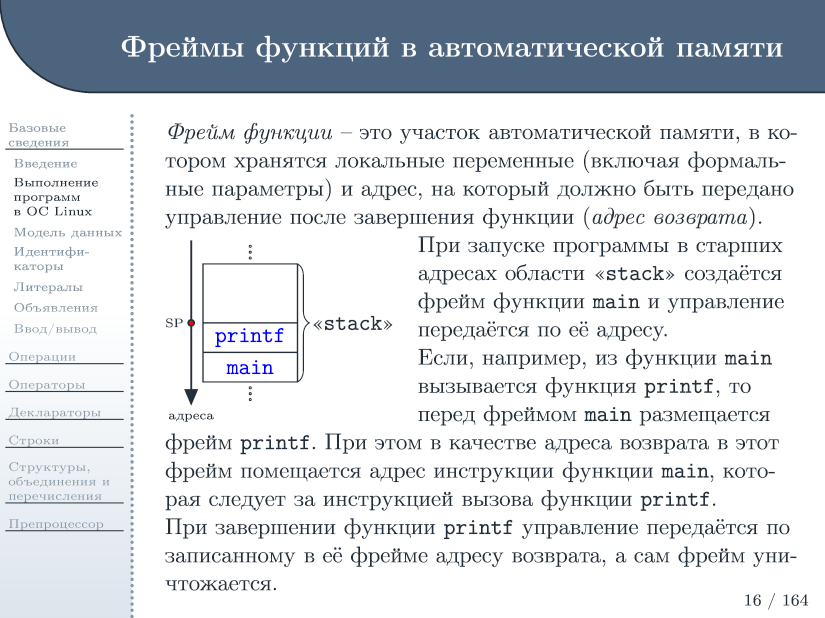

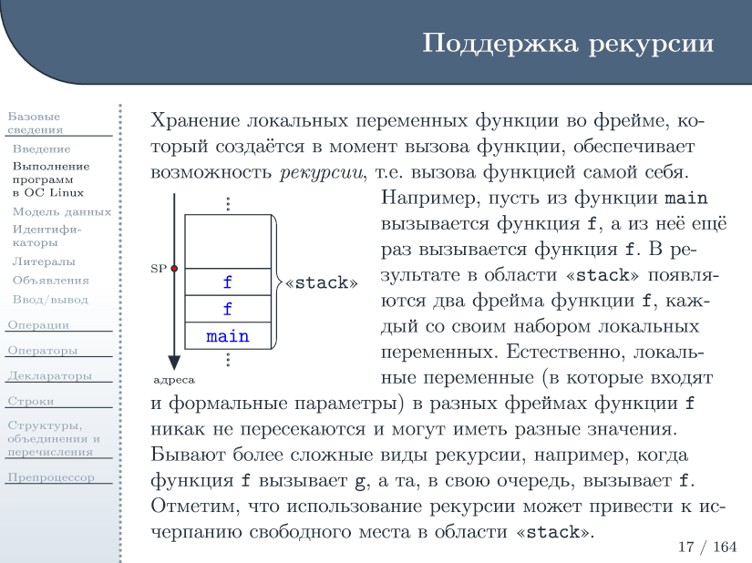

В языке Scheme дело обстоит аналогичным образом, с той лишь разницей, что
и фреймы стека, и данные распределяются в динамической памяти. И если ссылка
на фрейм где-то сохранена, то объект фрейма останется «жить» даже после
возврата функции.

Фреймы стека языка Си содержат адрес возврата и локальные переменные. Параметры
функций являются разновидностью локальных переменных.

Как мы помним, конструкции `let`, `let*` и `letrec`, а также `define` внутри
`begin`, вводящие локальные переменные, являются синтаксическим сахаром,
реализованным поверх `lambda`. Поэтому для языка Scheme локальные переменные
во фреймах стека — это _только_ параметры функций.

Фрейм стека будем изображать следующим образом:

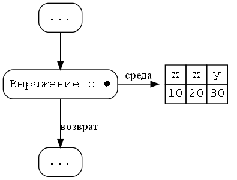

Фрейм стека содержит две ссылки. Одна из называется «среда» и ссылается
на значения локальных переменных — аргументов функции. Вторая — «возврат»
ссылается на предыдщий фрейм стека. Если фрейм стека не верхний,
то выражение будет содержать символ `●`, означающий точку, куда будет
возвращено выполнение вызова другой функции.

Рассмотрим пример — вычисление числа Фибоначчи по номеру. Пусть нам дана
функция

    (define fib
      (lambda (n)
        (if (= n 0)
            1
            (if (= n 1)
                1
                (+ (fib (- n 1)) (fib (- n 2)))))))

Рассмотрим процесс вычисления выражения

    (display (fib 3))

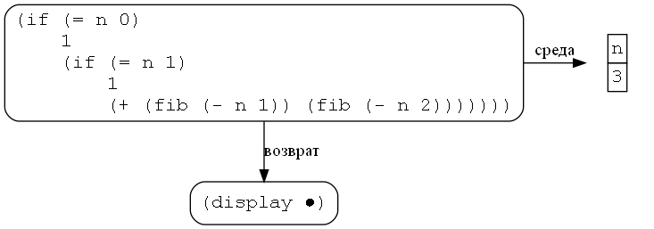

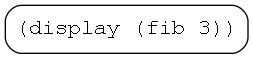

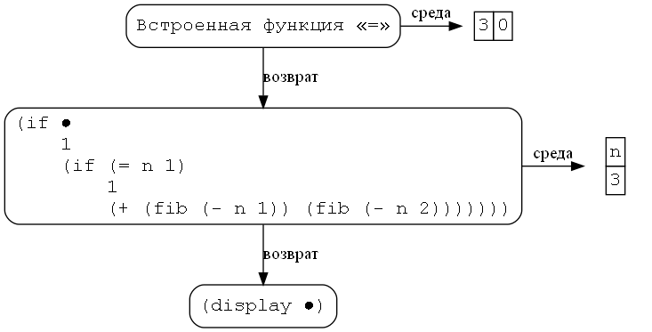

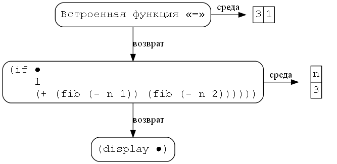
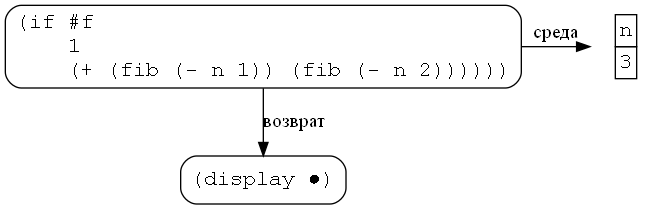

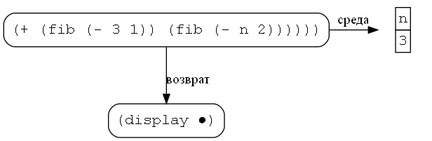
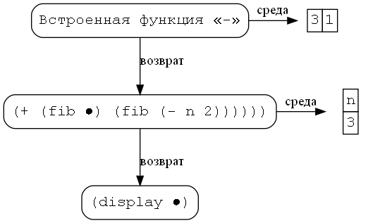
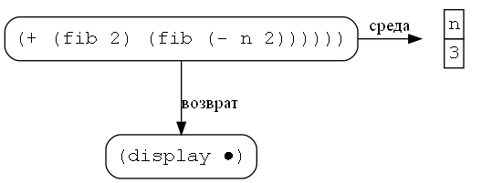
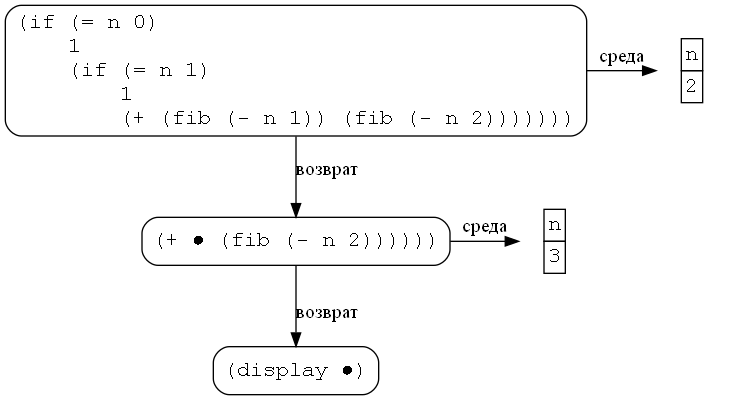
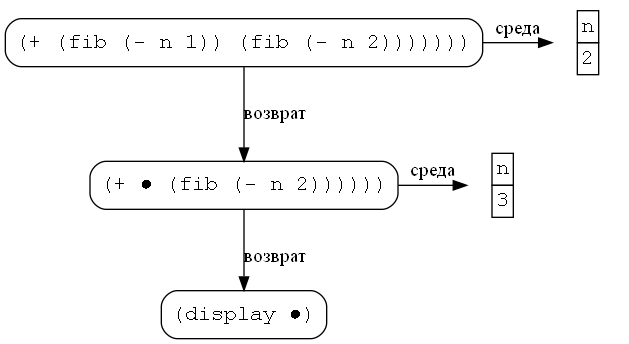
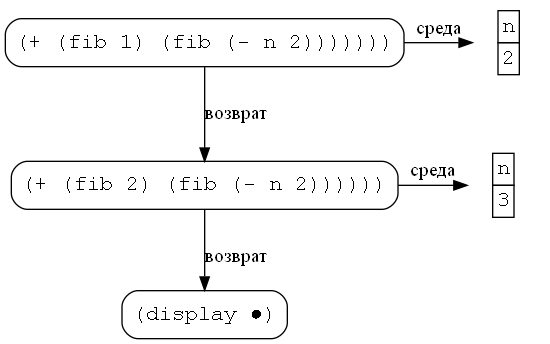
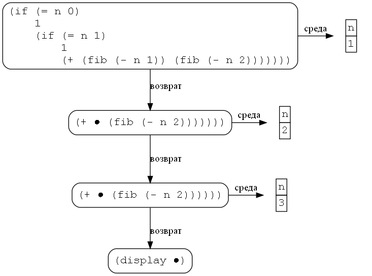

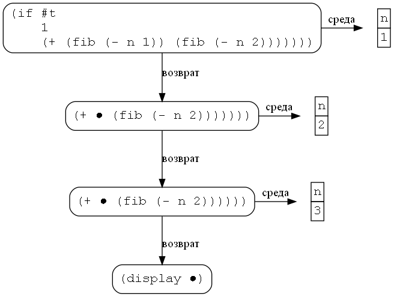
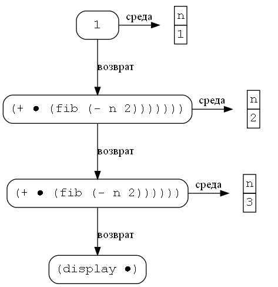
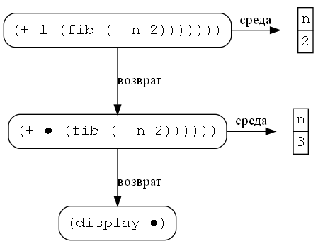

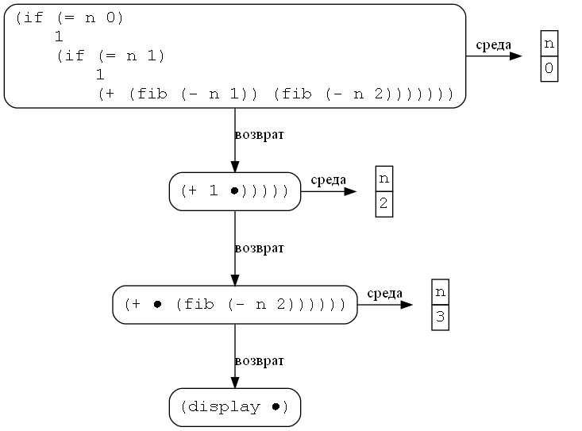
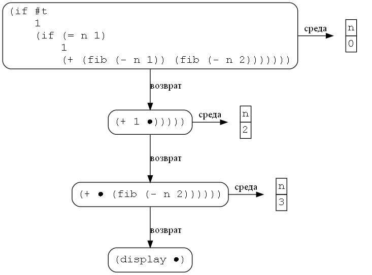
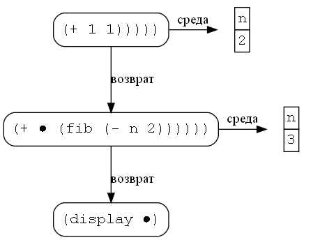
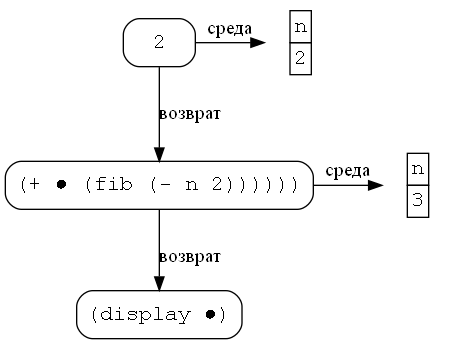
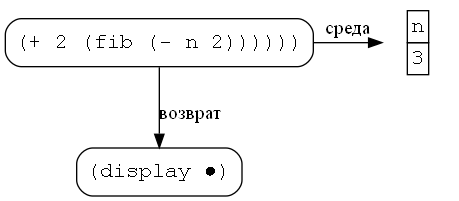

