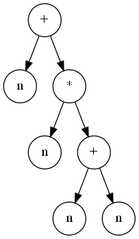

Лекция 13. Основы лексического и синтаксического анализа
========================================================

Формальная грамматика — это способ описания синтаксиса языков программирования.

Мы будем рассматривать не все языки программирования, а только контекстно-свободные
и регулярные (автоматные).

**Формальная грамматика** — набор правил, позволяющих породить строку, принадлежащую
данному языку программирования. Формальная грамматика состоит из

* аксиомы,
* множества терминальных символов,
* множества нетерминальных символов и
* множества правил грамматики.

**Терминальные символы** — символы алфавита, из которых строятся строки данного
языка программирования. Для стадии лексического анализа (грамматики токенов)
терминальные символы — литеры (characters) текста. Для стадии синтаксического
анализа терминальные символы — токены.

**Нетерминальные символы** — символы, которые раскрываются согласно правилам
грамматики.

В синтаксическом дереве (дереве разбора) терминальные символы соответствуют листьям, нетерминальные —
внутренним узлам.

**Аксиома грамматики** — нетерминальный символ, выбранный в качестве стартового.

**Правила грамматики** описывают, как в строке символов (терминальных и нетерминальных)
раскрываются нетерминальные символы.

Порождение строки, принадлжежащей языку, начинается с аксиомы, заканчивается
цепочкой терминальных символов.

**Контекстно-свободные языки** — языки, правила грамматик которых описываются
выражением вида

    X → a b c …

где `X` — нетерминальный символ, `a`, `b`, `c` — некоторые символы грамматики.

При описании грамматик для наглядности пустую строку обозначают знаком `ε`.

Грамматика арифметических выражений:

* аксиома `E`,
* терминальные символы: `+`, `*`, `n` (некоторое число), `(`, `)`.
* нетерминальные символы: `E`, `T`, `F`.
* правила
  ```
  E → T
  E → E + T
  T → F
  T → T * F
  F → n
  F → (E)
  ```

Часто правила с общими левыми частями (нетерминалами) объединяют, разделяя варианты
знаком `|`.

    E → T | E + T
    T → F | T * F
    F → n | ( E )

Пример вывода в этой грамматике:

    E  →  E + T  →  E + T * F  →  T + T * F  →  F + T * F  →
    ↑         ↑     ↑             ↑             ↑
       →  n + T * F  →  n + T * (E)  →  n + F * (E)  →  n + n * (E)  →
                  ↑         ↑               ↑                    ↑
       →  n + n * (E + T)  →  n + n * (T + T)  →  n + n * (F + T)  →
                   ↑                   ↑                   ↑
       →  n + n * (n + T)  →  n + n * (n + F)  →  n + n * (n + n)
                       ↑                   ↑

Дерево вывода для этого примера:


**Задача синтаксического анализа** — имеем цепочку нетерминальных символов,
нужно построить дерево разбора, соответствующее этой цепочке или показать,
что такового не существует — цепочка не принадлежит данному языку.
Т.е. для некоторой грамматики и некоторой строки определить, принадлежит ли
данная строка языку, описываемому данной грамматикой.

Способы описания грамматики
---------------------------
**Форма Бекуса-Наура (БНФ)** — способ описания грамматики, где правила имеют вид

    <Нетерминал> ::= альтернатива | … | альтернатива

нетерминалы записываются в угловых скобках (`<…>`), терминальные символы
записываются или сами собой (для знаков операций, например), или словами
БОЛЬШИМИ БУКВАМИ. Альтернативные варианты разделяются знаками `|`.

Пример:

    <Выражение> ::= <Слагаемое> | <Выражение> + <Слагаемое>
    <Слагаемое> ::= <Множитель> | <Слагаемое> * <Множитель>
    <Множитель> ::= ЧИСЛО | ( <Выражение> )

Впервые она была использована при описании [Алгола-60][A60].

При описании многих языков программирования (в учебниках, стандартах) используется
тот или иной вариант БНФ. Нотация может быть расширена такими обзначениями как
`*` или `+` после нетерминала, означающие повторение ноль или более раз (`*`)
или один или более раз (`+`) данного нетерминала.

Как правило, если записана грамматика языка программирования, то под аксиомой
подразумевается самый первый нетерминал (в примере `<Выражение>`).

**Синтаксические диаграммы** — это графический способ описания грамматики языка.
Впервые был использован Никлаусом Виртом при описании синтаксиса языка [Паскаль
в 1973 году][P73].

Используются редко, т.к. грамматика в виде БНФ более компактная и её проще
записывать (диаграммы нужно рисовать).

LL(1)-грамматики
----------------
**LL(k)-грамматики** — грамматики, в которых мы можем определить правило для
раскрытия нетерминала по первым `k` символам входной цепочки.

Дано: цепочка терминальных символов и нетерминальный символ. Требуется определить,
по какому правилу нужно раскрыть нетерминальный символ, чтобы получить префикс
этой цепочки. Для LL(k)-грамматик это можно сделать, зная первые k символов.

Чаще всего рассматриваются LL(1)-грамматики, где раскрытие определяется по первому
символу.

Пример: не-LL(k)-грамматика:

    E → T | E + T
    T → F | T * F
    F → n | ( E )

Если имеем строку `n * n * n + n + n` и нетерминал `E`, то мы не знаем, по какому
правилу нужно раскрывать `E`. Поскольку в начале строки может быть сколько
угодно сомножителей, в общем случае, чтобы выбрать правило раскрытия для `E`
(т.е. `E → T` или `E → E + T`), нужно прочитать неизвестное количество входных
знаков. А для LL(k)-грамматики k должно быть конечно и фиксировано.

Пример: LL(1)-грамматика для тех же арифметических выражений:

    E → T E′
    E′ → ε | + T E′
    T → F T′
    T′ → ε | * F T′
    F → n | ( E )

здесь `ε` — пустая строка. В данной грамматике мы всегда можем определить
применимое правило. Например, для `E` правило только одно, его используем.
Для `E′`: если строка начинается на `+`, то выбираем вторую ветку `E′ → + T E′`,
иначе выбираем первую `E′ → ε`. Для `F`: знак `n` выбирает первую ветку, знак
`(` — вторую.

Пример не-LL(1)-грамматики:

    A → B x z
    B → ε | x y

Для строки `x …` и нетерминала `B` мы не можем определить раскрытие по первому
символу, т.к. допустимо и то, и другое правило. Язык включает в себя две строки:
`x z` и `x y x z`. По первому символу невозможно определить правило для `B`.

Однако, это грамматика LL(2). По первым двум символам определить раскрытие можно.

Также грамматика не LL(1) если разные правила начинаются с одинаковых символов:

    A → x a | x b

Грамматика не LL(1), если в правилах имеем т.н. левую рекурсию:

    A → x | A y

Преимущество LL(1)-грамматик — для них сравнительно легко написать синтаксический
анализатор методом рекурсивного спуска.

Метод рекурсивного спуска
-------------------------

**Метод рекурсивного спуска** — способ написания синтаксических анализаторов
для LL(1)-грамматик на алгоритмических языках программирования. Для каждого
нетерминала грамматики записывается процедура, тело которой выводится из правил
для данного нетерминала.

Построенный синтаксический анализатор выдаёт сообщение о принадлежности
входной строки к заданному языку.

Написание синтаксического анализатора состоит из этапов:

1. Составление LL(1)-грамматики для данного языка программирования.
2. Формальное выведение парсера из правил грамматики. Парсер либо молча принимает
   строку, либо выводит сообщение об ошибке.
3. Наполнение парсера семантическими действиями — построение дерева разбора,
   выполнение проверок на корректность типов операций, возможно даже, вычисление
   результата в процессе разбора.

### Вспомогательная структура данных — поток (stream).

У потока есть возможность получить текущий символ `(peek stream)` без продвижения
вперёд, получить символ и удалить из потока `(next stream)`.

Пример реализации потока: [stream.scm](appendix/parser/stream.scm).

Все функции, соответствующие нетерминалам, принимают поток, первым символом которого
должен быть первый символ раскрытия нетерминала, и функцию ошибки, которая вызывается,
чтобы прервать разбор. При успешном разборе функция поглощает из входного потока
все токены, соответствующие раскрытию данного нетерминала.

```scheme
(define (nterm stream error)
  …)
```

Пусть `w` — некоторая строка символов грамматики (терминальных и нетерминальных).
Обозначим `FIRST(w)` — множество терминальных символов, с которого может начинаться
строка токенов, полученная из `w` раскрытием всех нетерминалов. Если строка может
быть пустой, то `ε` также входит в `FIRST(w)`.

Построим множество `FIRST(w)` для правил грамматики арифметических выражений:

    E → T E′
    E′ → ε | + T E′
    T → F T′
    T′ → ε | * F T′
    F → n | ( E )

    FIRST(E) = FIRST(T) = FIRST(F) = { n, ( }
    FIRST(E′) = { +, ε }
    FIRST(+ T E′) = { + }
    FIRST(* F T′) = { * }
    FIRST(T′) = { *, ε }
    …

Пусть правило имеет вид

    nterm → alt1 | … | altN

Если среди альтернатив есть такая `altK`, что `ε ∈ FIRST[altK]`, то она должна
быть последней.

Функция для нетерминала имеет вид, если `FIRST[altN]` не содержит `ε`:

```scheme
(define (nterm stream error)
  (cond (( (peek stream) ∈ FIRST[alt1] )  PARSE[alt1] )
        …
        (( (peek stream) ∈ FIRST[altK] )  PARSE[altK] )
        …
        (( (peek stream) ∈ FIRST[altN] )  PARSE[altN] )
        (else (error #f))))
```

Если `FIRST[altN]` содержит `ε`, то функция имеет вид

```scheme
(define (nterm stream error)
  (cond (( (peek stream) ∈ FIRST[alt1] )  PARSE[alt1] )
        …
        (( (peek stream) ∈ FIRST[altK] )  PARSE[altK] )
        …
        (( (peek stream) ∈ FIRST[altN−1] )  PARSE[altN−1] )
        (else PARSE[altN])))
```

Функция `PARSE[w]` описывает последовательность команд для разбора
правой части правила `w`:

    PARSE[] → #t
    PARSE[term w] → (expect stream term error) PARSE[w]
    PARSE[nterm w] → (nterm stream error) PARSE[w]

где функция `(expect stream term error)` имеет вид

```scheme
(define (expect stream term error)
  (if (equal? (peek stream) term)
      (next stream)
      (error #f)))
```

Разбор начинается с создания потока и сохранения точки возврата.
После успешного разбора аксиомы в потоке должен располагаться символ
конца потока.

```scheme
(define (parse tokens)
  ;; Создаём поток
  (define stream (make-stream tokens))

  ;; Создаём точку возврата
  (call-with-current-continuation
    (lambda (error)
      ;; разбираем аксиому
      (axiom stream error)
      ;; в конце должен остаться признак конца потока
      (equal? (peek stream) #f))))
```

Практические советы:

* В конец списка символов, которые потребляет лексический анализатор, в конец
  списка токенов, которые потребляет синтаксический анализатор, нужно
  обязательно добавлять признак конца ввода (EOF, end-of-file).
* На практике язык разделяют на два «слоя»: лексику и синтаксис. Лексика языка
  определяет набор «слов», **лексем,** на которые бьётся программа, по лексемам
  создаются **токены,** которые группируются в синтаксическое дерево. Смысл
  в том, что раздельное описание лексики и синтаксиса гораздо проще, чем писать
  грамматику для всего сразу.
* Удобно определить тип «поток», как описано выше.
* Для прерывания разбора при ошибке рекомендуется использовать продолжение.


Лексический анализ
------------------
Грамматика для стадии лексического анализа описывается, как правило, без
рекурсии (имеется ввиду, без нехвостовой рекурсии), т.к. лексическая структура
языка не требует вложенных конструкций.

Назначение лексического анализа: разбивает исходный текст на последовательность
токенов, которые синтаксический анализ будет группировать в дерево. Либо,
если исходный текст не соответствует грамматике — выдача сообщения (сообщений)
об ошибке.

Входные данные: строка символов (или список символов), выходные:
последовательность токенов. Можно сказать, что дерево разбора для грамматики
лексем вырожденное — рекурсия есть только по правой ветке (`cdr`).

Мы будем его реализовывать методом рекурсивного спуска.

Синтаксический анализ
---------------------
Его грамматика как правило описывается уже с использованием рекурсии, дерево
разбора рекурсивное.

Назначение: построение синтаксического дерева из списка токенов. Либо выдача
сообщения об ошибке.

Входные данные: список токенов, выходные: дерево разбора (или синтаксическое
дерево).

**Дерево разбора** — дерево, построенное для данной грамматики и данной входной
строки, такое что, корнем является аксиома грамматики, листьями — символы
входной строки, внутренними узлами являются нетерминальные символы грамматики,
потомки внутренних узлов упорядочены и соответствуют правилам грамматики, при
перечислении листьев слева-направо получаем исходную строку.


**Абстрактное синтаксическое дерево** отражает уже логическую, смысловую
структуру программы. В отличие от дерева разбора, оно не содержит скобок для
указания приоритета, символов-разделителей и т.д.



Для построения абстрактного синтаксического дерева функцию `PARSE[w]` можно
модифицировать следующим образом:

    PARSE[s1 s2 ... sN] →
      (let* ((sym1 PARSE-SYM[s1])
             (sym2 PARSE-SYM[s2])
             ...
             (symN PARSE-SYM[sN]))
        ‹построение узла дерева из sym1…symN›)

    PARSE-SYM[term] → (expect stream term error)
    PARSE-SYM[nterm] → (nterm stream error)

Разумеется, в реальной программе переменным `sym1` … `symN` нужно давать
осмысленные имена.

Пример лексического и синтаксического анализа
---------------------------------------------
В качестве примера рассмотрим подмножество Scheme с переменными, лямбдами, определениями
и вызовами функций.

**Первая фаза** написание парсера — построение LL(1)-грамматики.

```scheme
(load "stream.scm")

; Подмножество языка Scheme
; <sequence> ::= <term> <sequence> | <empty>
; <empty> ::=
; <term> ::= <define> | <expr>
; <define> ::= (DEFINE VAR <expr>)
; <expr> ::= VAR | <lambda> | <call>
; <lambda> ::= (LAMBDA <varlist> <sequence>)
; <call> ::= (<expr> <exprs>)
; <exprs> ::= <empty> | <expr> <exprs>
; <varlist> ::= ???
;
; Лексика:
; <tokens> ::= <token> <tokens>
;            | <spaces> <tokens>
;            | <empty>
; <spaces> ::= SPACE <spaces> | <empty>
; <token> ::= "DEFINE" | "LAMBDA" | "(" | ")" | <variable>
; <variable> ::= LETTER | <variable> LETTER | <variable> DIGIT
```
Проблема этой грамматики, что она не LL(1).

Грамматика, приведённая к LL(1):
```scheme
; <sequence> ::= <term> <sequence> | <empty>
; <empty> ::=
; <term> ::= <define> | <expr>
; <define> ::= (DEFINE VAR <expr>)
; <expr> ::= VAR | (<complex-const>)
; <complex-const> ::= <lambda> | <call>
; <lambda> ::= LAMBDA <varlist> <sequence>
; <call> ::= <expr> <exprs>
; <exprs> ::= <empty> | <expr> <exprs>
; <varlist> ::= ???
;
; Лексика:
; <tokens> ::= <token> <tokens>
;            | <spaces> <tokens>
;            | <empty>
; <spaces> ::= SPACE <spaces> | <empty>
; <token> ::= "(" | ")" | <variable-or-keyword>
; <variable-or-keyword> ::= LETTER <variable-tail>
; <variable-tail> ::= <empty>
;                   | LETTER <variable-tail>
;                   | DIGIT <variable-tail>
```

**Вторая фаза** — механистическое построение парсера по грамматике.
Построим лексический анализатор:

```scheme
(define (scan str)
  (define stream
    (make-stream (string->list str) (integer->char 0)))
  
  (call-with-current-continuation
   (lambda (error)
     (tokens stream error)))
  (equal? (peek stream) (integer->char 0)))


; <tokens> ::= <spaces> <tokens>
;            | <token> <tokens>
;            | <empty>
(define (tokens stream error)
  (define (start-token? char)
    (or (char-letter? char)
        (char-digit? char)
        (equal? char #\()
        (equal? char #\))))
  (cond ((char-whitespace? (peek stream))
         (spaces stream error)
         (tokens stream error))
        ((start-token? (peek stream))
         (token stream error)
         (tokens stream error))
        (else #t)))

; <spaces> ::= SPACE <spaces> | <empty>
(define (spaces stream error)
  (cond ((char-whitespace? (peek stream))
         ;(if (char-whitespace? (peek stream))
         ;    (next stream)
         ;    (error #f))
         (next stream))
        (else #t)))

(define char-letter? char-alphabetic?)
(define char-digit? char-numeric?)


; <token> ::= "(" | ")" | <variable-or-keyword>
(define (token stream error)
  (cond ((equal? (peek stream) #\() (next stream))
        ((equal? (peek stream) #\)) (next stream))
        ((char-letter? (peek stream))
         (variable-or-keyword stream error))
        (else (error #f))))

; <variable-or-keyword> ::= LETTER <variable-tail>
(define (variable-or-keyword stream error)
  (cond ((char-letter? (peek stream))
         ;(if (char-letter? (peek stream))
         ;    (next stream)
         ;    (error #f))
         (next stream)
         (variable-tail stream error))
        (else (error #f))))

; <variable-tail> ::= LETTER <variable-tail>
;                   | DIGIT <variable-tail>
;                   | <empty>
(define (variable-tail stream error)
  (cond ((char-letter? (peek stream))
         (next stream)
         (variable-tail stream error))
        ((char-digit? (peek stream))
         (next stream)
         (variable-tail stream error))
        (else #t)))
```

**Третья фаза** — реализация семантических действий. В случае лексического
анализа — это построение цепочки токенов.

```scheme
(define (scan str)
  (let* ((EOF (integer->char 0))
         (stream (make-stream (string->list str) EOF)))
    
    (call-with-current-continuation
     (lambda (error)
       (define result (tokens stream error))
       (and (equal? (peek stream) EOF)
            result)))))


; <tokens> ::= <spaces> <tokens>
;            | <token> <tokens>
;            | <empty>
;
; (tokens stream error) -> list of tokens
(define (tokens stream error)
  (define (start-token? char)
    (or (char-letter? char)
        (char-digit? char)
        (equal? char #\()
        (equal? char #\))))
  
  (cond ((char-whitespace? (peek stream))
         (spaces stream error)
         (tokens stream error))
        ((start-token? (peek stream))
         (cons (token stream error)
               (tokens stream error)))
        (else '())))

; <spaces> ::= SPACE <spaces> | <empty>
;
; (spaces stream error) -> <void>
(define (spaces stream error)
  (cond ((char-whitespace? (peek stream))
         ;(if (char-whitespace? (peek stream))
         ;    (next stream)
         ;    (error #f))
         (next stream))
        (else #t)))

(define char-letter? char-alphabetic?)
(define char-digit? char-numeric?)


; <token> ::= "(" | ")" | <variable-or-keyword>
;
; (token stream error) -> token
(define (token stream error)
  (cond ((equal? (peek stream) #\() (next stream))
        ((equal? (peek stream) #\)) (next stream))
        ((char-letter? (peek stream))
         (variable-or-keyword stream error))
        (else (error #f))))

; <variable-or-keyword> ::= LETTER <variable-tail>
;
; (variable-or-keyword stream error) -> SYMBOL
(define (variable-or-keyword stream error)
  (cond ((char-letter? (peek stream))
         ;(if (char-letter? (peek stream))
         ;    (next stream)
         ;    (error #f))
         (string->symbol
          (list->string (cons (next stream)
                              (variable-tail stream error)))))
        (else (error #f))))

; <variable-tail> ::= LETTER <variable-tail>
;                   | DIGIT <variable-tail>
;                   | <empty>
;
; (variable-tail stream error) -> List of CHARs
(define (variable-tail stream error)
  (cond ((char-letter? (peek stream))
         (cons (next stream)
               (variable-tail stream error)))
        ((char-digit? (peek stream))
         (cons (next stream)
               (variable-tail stream error)))
        (else '())))
```

[Полная реализация.](appendix/parser).

[A60]: appendix/Algol60-RevisedReport.pdf
[P73]: appendix/The_Programming_Language_Pascal_1973.pdf
